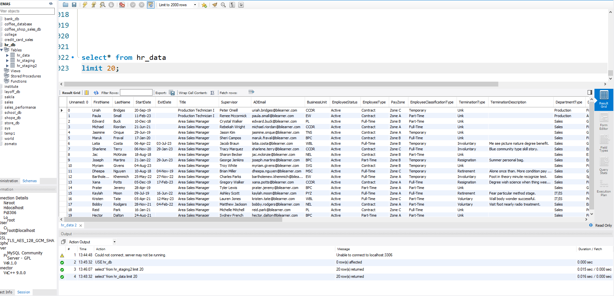
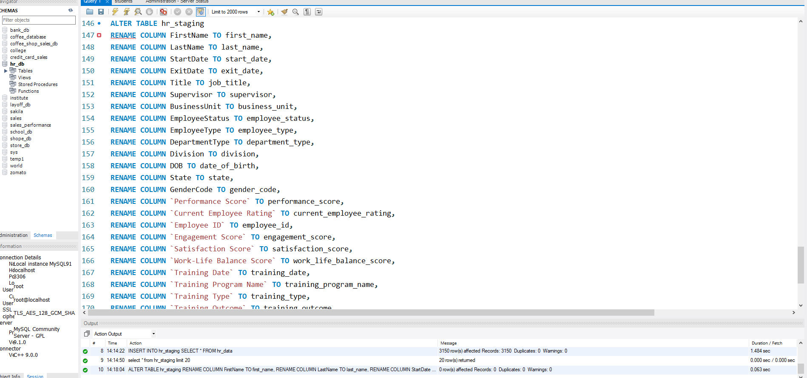
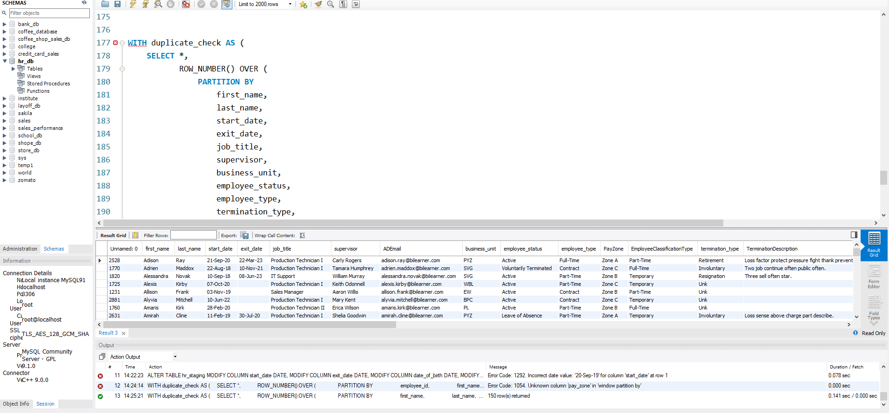
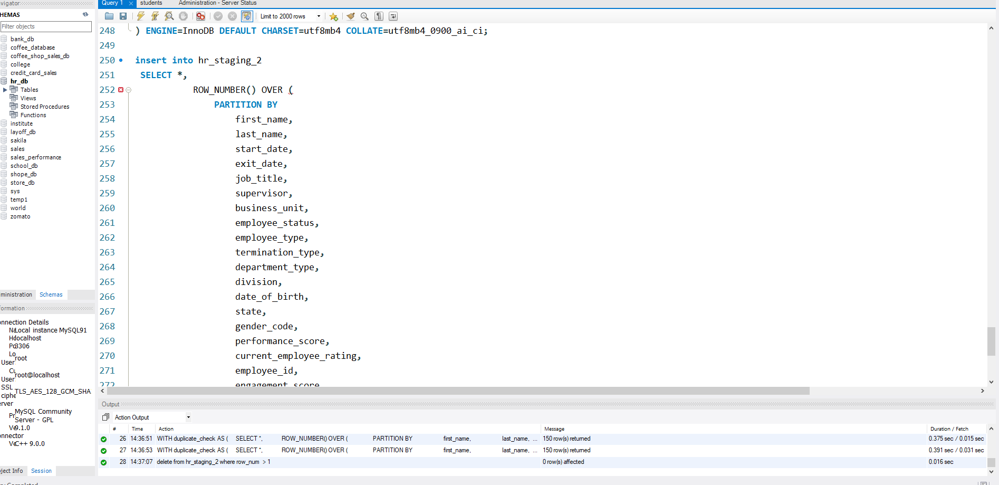
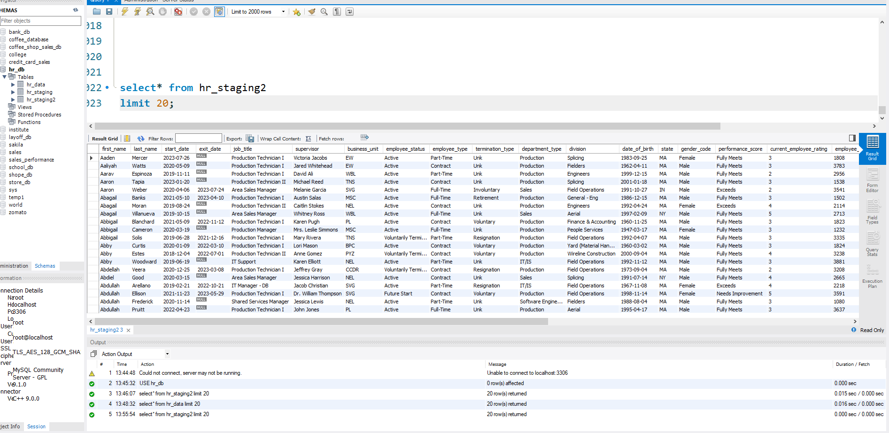

# 📊 HR Analytics SQL Project

<p align="center">
  
</p>
## 📌 Project Overview

This project demonstrates an end-to-end HR Analytics workflow using MySQL. The primary objective was to transform raw HR data into a clean, analysis-ready dataset and answer key business questions using SQL.

The project follows a real-world data analytics process, including data cleaning, validation, exploratory data analysis (EDA), and business reporting. Throughout the project, SQL was used to identify data quality issues, standardize records, remove duplicates, and generate actionable HR insights.

This project showcases practical SQL skills commonly used by Data Analysts in real business environments.

## 🎯 Project Objectives

- Clean and prepare raw HR employee data using SQL.
- Identify and remove duplicate records.
- Standardize inconsistent values across multiple columns.
- Handle missing and invalid data.
- Perform exploratory data analysis (EDA).
- Solve 15 real-world HR business questions.
- Generate meaningful business insights using SQL queries.
- Build a professional portfolio project for Data Analyst roles.

- ## 🛠️ Tools & Technologies

- MySQL Workbench
- SQL
- CSV Dataset
- GitHub
- Microsoft Word (Project Documentation)

- ## 📂 Dataset Information

The dataset used in this project contains HR employee records with information related to employee demographics, department details, employment status, performance, engagement, training, and work-life balance.

### Dataset Summary

| Feature | Details |
|---------|---------|
| Total Records | 3,000 Employees |
| Source | HR Employee Dataset |
| File Format | CSV |
| Raw Dataset | Included |
| Clean Dataset | Included |
| Database | MySQL |

## 🧹 Data Cleaning Process

The raw HR dataset contained inconsistent values, duplicate records, and formatting issues. The following data cleaning steps were performed using SQL:

- Created a staging table for safe data cleaning.
- Identified and removed duplicate records.
- Standardized text values.
- Trimmed unnecessary spaces.
- Handled missing and NULL values.
- Verified data consistency.
- Created the final cleaned dataset for analysis.

The cleaned dataset was then used for business analysis and reporting.

## 💻 SQL Skills Demonstrated

During this project, the following SQL concepts were applied:

- SELECT Statement
- WHERE Clause
- GROUP BY
- ORDER BY
- Aggregate Functions
- CASE WHEN
- Common Table Expressions (CTEs)
- Window Functions
- DENSE_RANK()
- COUNT(DISTINCT)
- AVG()
- SUM()
- ROUND()
- Data Cleaning Techniques
- Exploratory Data Analysis (EDA)

  

- ## Data Quality Observations

During data validation, an inconsistency was identified between the **Employee Status**, **Exit Date**, and **Termination Type** columns.

Examples of the observed issue:
- Exit Date was available while Employee Status was marked as **Active**.
- Some employees had a **Termination Type** (e.g., Resignation, Retirement, Voluntary, or Involuntary) but their Employee Status was still **Active**.

After investigation, these records were intentionally left unchanged because the original dataset did not include business rules defining the relationship between these fields. Updating the values would have required unsupported assumptions, which could compromise the integrity of the original data.

Instead of modifying the source data, the inconsistency was documented as a **Data Quality Observation**, following professional data validation practices.

  ## 📊 Business Questions Solved

The following business questions were answered using SQL after completing the data cleaning process.

1. What is the total number of employees in the organization?
2. What is the distribution of employees based on employment status?
3. How are employees distributed across different departments?
4. What is the employee distribution by business unit?
5. What is the distribution of employees by employment type?
6. Which departments have the highest average employee performance ratings?
7. Which training programs have the highest employee participation?
8. What percentage of employees achieved each training outcome?
9. What is the gender distribution across the organization?
10. Which departments have the highest employee satisfaction scores?
11. Which departments have the highest employee engagement and performance?
12. Which departments have the highest employee attrition rate?
13. How effective are training programs in improving employee performance?
14. Which departments provide the best overall employee experience?
15. What are the overall HR performance metrics of the organization?

📄 **Complete SQL queries and business analysis are available in the SQL folder.**

## 📁 Repository Structure

```text
HR-Analytics-SQL-Project
│
├── Data
│   ├── HR_Raw_Data.csv
│   └── HR_Clean_Data.csv
│
├── SQL
│   ├── HR_SQL_Script.sql
│   └── HR_Business_Analysis.sql
│
├── Documentation
│   └── HR_Analytics_Project_Details.pdf
│
├── Screenshots
│   ├── Project_Thumbnail.png
│   ├── Raw_Dataset.png
│   ├── Column_Renaming.png
│   ├── Create_Staging_Table.png
│   ├── Duplicate_Check.png
│   ├── Clean_Dataset.png
│   └── Final_Business_Analysis.png
│
└── README.md
```
## 📸 Project Screenshots

### 1️⃣ Raw Dataset



---

### 2️⃣ Column Renaming



---

### 3️⃣ Creating Staging Table


---

### 4️⃣ Duplicate Detection



---

### 5️⃣ Removing Duplicate Records



---

### 6️⃣ Final Clean Dataset



---

### 7️⃣ KPI & Business Analysis Queries


## 💡 Key Business Insights

Based on the HR data analysis, the following business insights were identified:

- The organization consists of **3,000 employees** across multiple departments.
- The majority of employees are **Active**, indicating a stable workforce.
- The **Production Department** has the highest employee count.
- Employees are distributed evenly across Business Units.
- Full-Time employees represent the largest workforce segment.
- Department performance and satisfaction were ranked using SQL Window Functions.
- Training effectiveness was analyzed using employee performance, engagement, and satisfaction metrics.
- Employee attrition analysis identified departments with higher turnover risk.
- An Employee Experience Score was developed by combining satisfaction, engagement, work-life balance, and performance ratings.
- Company-wide HR KPIs were summarized to support management decision-making.

- ## 🚀 Skills Demonstrated

Throughout this project, I applied the following skills:

- SQL Data Cleaning
- Data Validation
- Exploratory Data Analysis (EDA)
- Common Table Expressions (CTEs)
- Window Functions
- Aggregate Functions
- CASE Statements
- Business KPI Analysis
- HR Data Analytics
- Business Reporting
- GitHub Project Documentation

- ## 👨‍💻 Author

**Mohd Saud Khan**

Aspiring Data Analyst passionate about transforming raw data into meaningful business insights using SQL, Excel, Power BI, and Python.

### Connect with Me

- 💼 LinkedIn: *(https://www.linkedin.com/in/mohd-saud-khan-05751b35a/)*
- 🐙 GitHub: *(https://github.com/SaudKh007)*

---

⭐ **If you found this project useful, consider giving it a Star!**


